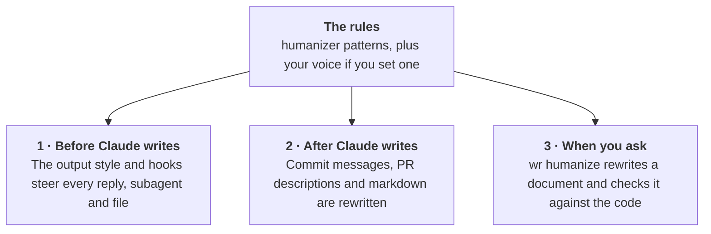

# writing-register

**Make Claude Code write like a careful colleague, without the marks of machine-written prose and, if you want, in your own voice.**

[](LICENSE)
[](https://github.com/pablogiaccaglia/writing-register/actions/workflows/tests.yml)
[](#quick-start)
[](https://skills.sh/pablogiaccaglia/writing-register/writing-register)
[](pyproject.toml)

Text written by an AI assistant tends to carry the same marks: filler words such as "seamlessly" and "pivotal", dashes everywhere, the "it's not just X, it's Y" construction and a closing slogan. If you work with Claude Code every day, you end up correcting the same things in every README, commit message and report it writes. writing-register removes them at three points in the work:

1. **Before Claude writes.** Every session and every subagent receives instructions on how to write, so most of the problems never appear.
2. **After Claude writes.** The plugin rewrites commit messages, pull request descriptions and markdown files automatically, and shows Claude each change so it can check that the meaning survived.
3. **When you ask.** `wr humanize FILE` rewrites a finished document, checks every sentence it changed against the repository's code, and puts back any sentence the code does not support.

All three follow the [humanizer](https://github.com/blader/humanizer) skill, a widely used list of the patterns that make text read as machine-written. You can add a voice on top: a set of written rules about how you want to read, built from the corrections you already make. This repository ships an example voice and a guide to building your own.

## Contents

- [How it works](#how-it-works)
- [Before and after](#before-and-after)
- [Quick start](#quick-start)
- [The three layers](#the-three-layers)
- [Voices: a design system for how you read](#voices-a-design-system-for-how-you-read)
- [Configuration](#configuration)
- [Updating and turning it off](#updating-and-turning-it-off)
- [What is in the repository](#what-is-in-the-repository)
- [License](#license)

## How it works



The patterns come from the humanizer skill, which this repository keeps as an unchanged copy in `vendor/humanizer/`. Where a voice and the patterns disagree, the voice wins. No voice is used until you turn one on, so nobody ends up writing in someone else's voice by accident.

## Before and after

Below is a paragraph of the kind an assistant writes, followed by what `wr humanize` made of it with the example voice, in one model call that took 5 seconds:

> **Before.** The alerting subsystem is a pivotal component that seamlessly empowers operators to stay on top of their weather stations. It's not just about sending notifications — it's about delivering actionable insights at the right time. When a station misses five consecutive polls, the system intelligently raises an alert, ensuring that no outage goes unnoticed. Alerts are sent to the dashboard, and they are also written to `out/alerts.log`, providing a robust audit trail. In short, alerting is the heartbeat of reliable station monitoring.

> **After.** The alerting subsystem tells operators when one of their weather stations stops responding. It raises an alert when a station misses five consecutive polls, so an outage does not go unnoticed. Each alert appears on the dashboard and is also written to `out/alerts.log`, which keeps an audit trail of every alert raised.

The rewrite keeps every fact (the five polls, the dashboard, the log file) and drops the filler, the dash, the "not just X" construction and the closing slogan.

## Quick start

You need Python 3.11 or newer, [uv](https://docs.astral.sh/uv/) (or pipx), and [Claude Code](https://code.claude.com), installed and logged in through `claude` itself.

**1. Install the `wr` command.** The command runs the rewrites, and the plugin's hooks call it.

```bash
uv tool install git+https://github.com/pablogiaccaglia/writing-register
wr voice      # says there is no voice until you turn one on
```

**2. Install the Claude Code plugin.** Inside Claude Code, run:

```
/plugin marketplace add pablogiaccaglia/writing-register
/plugin install writing-register@writing-register
```

Restart Claude Code afterwards, since a session loads its plugins when it starts. The plugin contains two skills, the hooks and an output style.

**3. Choose how Claude writes.** Pick one:

- **The patterns only:** run `/output-style writing-register:human-prose`, or choose that style in `/config`.
- **The patterns and a voice:** set a voice (step 4), then run `wr style --enable`, which writes an output style named `writing-register` carrying both and selects it.

**4. Optional: a voice and the automatic rewrites.** Create `~/.config/writing-register/config.toml`:

```toml
voice = "technical-colleague"          # the example voice, or a path to your own
auto = ["markdown", "commit", "pr"]    # what the plugin rewrites by itself
```

**5. If you use the automatic markdown rewrite,** add `*.refused.md` to your global git ignore file (`~/.config/git/ignore`). A rewrite that fails its checks is saved beside the original under that name, and the plugin skips any repository that does not ignore those files.

### Other agents: skills only

Codex, Cursor and other agents can install the two skills through [skills.sh](https://skills.sh), without the hooks or the output style:

```bash
npx skills add pablogiaccaglia/writing-register
```

The writing-register skill calls `wr`, so install the command as in step 1 as well.

## The three layers

### 1. Steering: before Claude writes

Claude Code sends the text of the selected output style with every request, and the style is kept when a long conversation is compacted, which makes it the strongest place to say how to write. The plugin ships `writing-register:human-prose`, which carries the patterns, and `wr style` builds `writing-register`, which carries your voice as well. Both styles keep Claude Code's own coding instructions and govern only what a person reads. A report from one agent to another stays plain and literal, since a model reads it.

An output style does not reach subagents, so the plugin's hooks give every subagent the same instructions when it starts. When no style is selected, the session-start hook gives them to the main conversation too. On one user's transcripts, steering alone took dashes in Claude's replies from 17.70 to 0.40 per 1,000 words. [docs/STEERING.md](docs/STEERING.md) explains what each way of instructing the model reaches, and what was measured.

### 2. Automatic rewrites: after Claude writes

Each value in `auto` turns on one kind of rewrite:

- `commit`: when Claude runs `git commit`, the plugin rewrites the message before the command runs, which usually takes a few seconds. Trailers such as `Co-Authored-By:` stay as they are. If the rewrite takes longer than 90 seconds, the command runs with the message Claude wrote.
- `pr`: the plugin does the same for the description passed to `gh pr create` or `gh pr edit`.
- `markdown`: after Claude's turn ends, the plugin rewrites in the background the prose Claude added to markdown files.

The markdown rewrite sends only the sentences and list items Claude added, never the rest of the file and never text you typed yourself. A change of fewer than 8 words is left alone. The rewrite changes prose only and adds no facts, because the model that rewrites does not see the repository. When you send your next message, Claude is shown each passage that changed, old and new, so it can check that each one still says what it meant, since Claude wrote the text with the repository open.

Every automatic rewrite runs the same checks as `wr humanize`: a rewrite that changes code, alters a link, or introduces a number or name found nowhere in the source is refused, and the text stays as Claude wrote it. Some files are never rewritten: files outside a git repository or ignored by git, changelogs, and anything under `vendor/`, `node_modules/`, `tests/`, `test/`, `fixtures/`, `testdata/` or `.claude/`. No hook runs in a scripted `claude -p` session. Chat replies are not rewritten either, because no hook can change a reply before it is shown.

### 3. `wr humanize`: a checked rewrite of a finished document

Run it from the root of the repository whose prose you want to rewrite, then read the diff:

```bash
wr humanize --dry-run docs/SETUP.md   # print the diff, write nothing
wr humanize docs/SETUP.md
git diff docs/SETUP.md
```

For each file the command makes two model calls. The first rewrites the document, given the patterns, your voice if one is on, and the document's sources: the text files it links to or names by path, never a file git ignores. That model may use the sources to explain what the document assumes the reader already knows.

The second call is the checker. It exists because the model that rewrites has not seen the code: on 2026-09-15, in one repository's docs, it added sentences that were false yet passed every string check, such as a claim that a report wrote each finding to a database when a separate script does that. The checker can read and search a copy of the repository's tracked files and nothing else. For every sentence the rewrite added or changed, it must cite the line of code that confirms or contradicts it, or say why the code cannot decide. wr checks each citation and puts back the paragraph or list item around any sentence the code contradicts or cannot confirm.

The file is replaced only if the rewrite passes the string checks and the checker. A refused rewrite is saved beside the file as `SETUP.refused.md`, so you can copy the good parts by hand. A short file is rewritten in a few seconds. The check took between one and seven minutes on the documents measured, and `--no-check` skips it. [docs/USAGE.md](docs/USAGE.md) lists every option and every check.

## Voices: a design system for how you read

A voice is a written specification of how one person wants to read the text a model writes for them: who the reader is, which terms need explaining, in what order ideas come, how numbers and claims are worded, and how each kind of text (a README, a commit message, a status update) differs. It is built from the corrections you actually make, and every rule can be traced back to them.

A voice can start as a single markdown file. Once it grows, it becomes a directory that works as a small design system for writing:

```
voice/technical-colleague/
  voice.toml       name, size budget, the order of the rule files
  rules/           what the model receives: reader, register, order, claims, math, figures, ...
  evidence/        dated quotes and before-and-after examples behind each rule
  decisions.md     where requests pulled in different directions, and what was chosen
```

Each rule carries an identifier, so evidence and decisions can point at it and a change touches only the rule it concerns. These commands keep the voice consistent:

| Command | What it does |
|---|---|
| `wr voice check` | Checks the structure: every rule listed, backed by evidence, stated once, within budget |
| `wr voice show RULE` | Prints a rule with every piece of evidence and every decision behind it, which is what to read before changing it |
| `wr voice build` | Writes the whole voice as one readable file |
| `wr voice split FILE` | Turns a single-file voice into a directory |

[`voice/technical-colleague/`](voice/technical-colleague/) is a complete example: a technical lead's voice with 141 rules in 22 files, covering everything from the reader and the register to mathematics, figures and data splits, with the owner's private details removed. [docs/VOICE_FORMAT.md](docs/VOICE_FORMAT.md) is the format reference. [docs/BUILDING_A_VOICE.md](docs/BUILDING_A_VOICE.md) explains how to build your own voice: collect your corrections, turn each into a rule a reader can check, admit a rule only when it recurs, and measure whether it changes anything. The scripts in `scripts/` search your Claude Code conversations for those corrections.

## Configuration

All settings live in one file on your machine, `~/.config/writing-register/config.toml`, and never in a repository:

| Setting | Values | Effect |
|---|---|---|
| `voice` | a voice name, a path to a voice file or directory, or `"none"` | The voice every layer follows; a relative path is read from the folder that holds the file |
| `auto` | any of `"markdown"`, `"commit"`, `"pr"` | What the plugin rewrites by itself |
| `metrics` | `true` (the default) or `false` | Whether each automatic rewrite leaves one line of numbers, which `wr report` totals |

`wr voice` shows the active voice and where the choice came from. A mistake in the file, such as a misspelled setting, makes `wr` stop with a message naming it, and the plugin repeats that message at the start of each session. The voice and the automatic rewrites stay off until the mistake is fixed.

## Updating and turning it off

```bash
uv tool upgrade writing-register
claude plugin marketplace update writing-register
claude plugin update writing-register@writing-register
```

Claude Code does not update plugins from other people's marketplaces by itself, so run the last two commands when a new version is out. The update reaches the sessions you start afterwards.

- To stop an automatic rewrite, remove it from `auto`. The hooks read the file each time they run, so no restart is needed.
- To stop using a voice, set `voice = "none"` or remove the line.
- To stop the steering, choose another output style in `/config`.
- To turn everything off, run `claude plugin disable writing-register@writing-register` and restart Claude Code.

## What is in the repository

| Path | What it is |
|---|---|
| [`src/writing_register/`](src/writing_register/) | The `wr` command: `humanize.py` builds the prompt and the checks, `verify.py` is the checker, `hooks.py` answers the plugin's hooks, `passages.py` finds the prose that changed in a turn, `style.py` builds the output styles, `voice.py` and `voice_tools.py` read and check voices |
| [`vendor/humanizer/`](vendor/humanizer/) | The humanizer skill, an unchanged copy; [`vendor/UPSTREAM.md`](vendor/UPSTREAM.md) records the commit |
| [`voice/technical-colleague/`](voice/technical-colleague/) | The example voice; [`voice/technical-colleague.md`](voice/technical-colleague.md) is generated from it for reading |
| [`plugin/skills/writing-register/`](plugin/skills/writing-register/SKILL.md), [`hooks/hooks.json`](hooks/hooks.json), [`output-styles/`](output-styles/) | The plugin's skill, hooks and output style; [`.claude-plugin/`](.claude-plugin/) holds its manifests |
| [`scripts/`](scripts/) | Mining conversations for a voice (`claude_prose.py`, `mine_*.py`), measuring it (`tell_rates.py`), and measuring the checker (`replay_check.py`, `rejudge_replay.py`, `agreement.py`) |
| [`docs/`](docs/) | [USAGE](docs/USAGE.md), [STEERING](docs/STEERING.md), [VOICE_FORMAT](docs/VOICE_FORMAT.md), [BUILDING_A_VOICE](docs/BUILDING_A_VOICE.md) |
| [`scrub/`](scrub/), [`scripts/scrub_check.py`](scripts/scrub_check.py) | The check that keeps confidential text out of this public repository |

To work on the code itself, clone the repository and run `./install.sh`, which installs an editable copy. [CONTRIBUTING.md](CONTRIBUTING.md) covers the rest.

## License

MIT, Copyright (c) 2026 Pablo Giaccaglia; see [LICENSE](LICENSE). The humanizer skill in `vendor/humanizer/` keeps its own MIT license.
